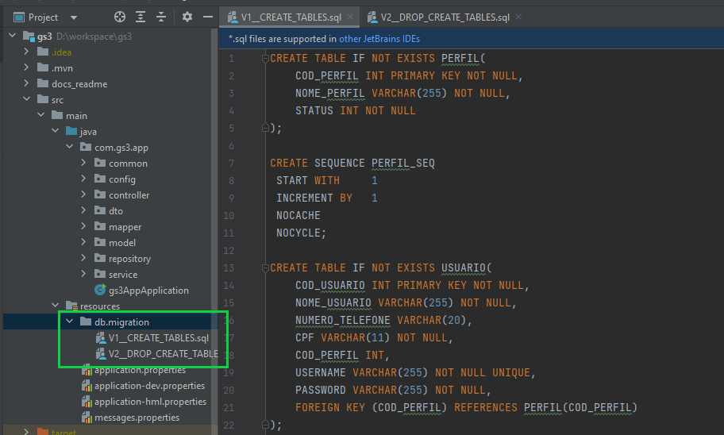

# Projeto Java 1.8 com spring boot 2.7

Cadastro e consulta de usuários com perfis

## ✒️ Autor.

Matheus Victor Marques Alves - matheusmalves@yahoo.com.br

## 🛠 Stack.

<ol>
  <li>Java</li>
  <li>Spring boot</li>
  <li>JPA</li>
  <li>H2</li>
  <li>FlyWay DB</li>
  <li>Junit</li>
  <li>Mockito</li>
  <li>Swagger</li>
  <li>Lombok</li>
  <li>Postman</li>
</ol>

## ⚙️ Structure.

## ⚙️ Data Base.

O banco de dados é criado e versionado pelo FlyWay

## ⚙️ Executando o projeto.

~~~~shell
 mvn spring-boot:run
~~~~

## ⚙️ Swagger.

* [http://localhost:8081/swagger-ui.html](http://localhost:8081/swagger-ui.html)

## ⚙️ Teste com Postman - Criar Usuário.

## ⚙️ Teste com Postman - Criar Perfil.

## ⚙️ Teste com Postman - Buscar Usuários.

## ⚙️ Teste com Postman - Autenticar Usuários.

## ⚙️ Teste com Postman - Buscar Perfis.

